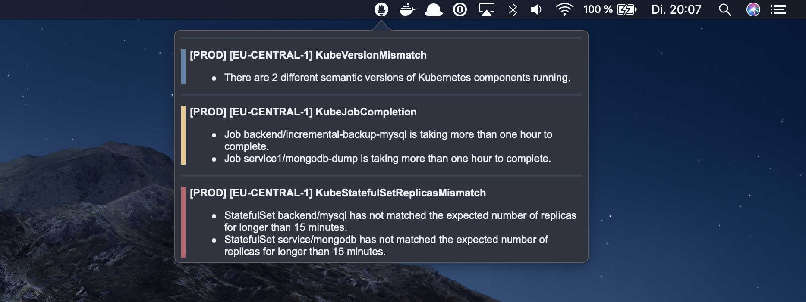

# Alertmanager for macOS



The **Alertmanager for macOS** is a small macOS application which shows alerts from [Prometheus Alertmanagers](https://github.com/prometheus/alertmanager). You can setup multiple Alertmanager instances to retrive alerts from. The alerts are grouped by the specified settings in you Alertmanager configuration.

## Usage

Create a new file called `.alertmanager.json` in your home directory and provide a configuration for the Alertmanager app. An example config can be found in the following code block. For all available options take a look at the [configuration](#configuration) section.

```json
{
  "refreshInterval": 60,
  "severityLabel": "severity",
  "severityInfo": "info",
  "severityWarning": "warning",
  "severityError": "error",
  "severityCritical": "critical",
  "titleTemplate": "[{{ name | uppercase }}] [{{ labels['cluster'] | uppercase }}] {{ labels['alertname'] }}",
  "alertTemplate": "{{ annotations['message'] }}",

  "alertmanagers": [
    {
      "name": "PROD",
      "url": "http://localhost:9093"
    }
  ]
}
```

Next go to the [releases](https://github.com/ricoberger/Alertmanager/releases) page and download the latest version of the Alertmanager app. Unpack the downloaded ZIP file and start the app.

## Configuration

You can configure the following values for the Alertmanager app:

### General

| Value | Description | Default |
| ----- | ----------- | ------- |
| `refreshInterval` | The interval in which the alerts are retrieved. | `60` |
| `severityLabel` | The name of the label for the severity of an alert. | |
| `severityInfo` | Value of the severity label for an info alert. | `info` |
| `severityWarning` | Value of the severity label for an warning alert. | `warning` |
| `severityError` | Value of the severity label for an error alert. | `error` |
| `severityCritical` | Value of the severity label for an critical alert. | `critical` |
| `titleTemplate` | Template for the title. The template can use the name of the Alertmanager and the group labels. | `[{{ name }}]  {{ key }}: {{ value }} ` |
| `alertTemplate` | Template for a single alert. The template can use the annotations and labels of the alert. | ` {{ key }}: {{ value }} ` |
| `themeBg` | Background color. | `#2E3440` |
| `themeBgLight` | Light background color. | `#3B4252` |
| `themeFg` | Foreground color. | `#ECEFF4` |
| `themeInfo` | Info color. | `#5E81AC` |
| `themeWarning` | Warning color. | `#EBCB8B` |
| `themeError` | Error color. | `#D08770` |
| `themeCritical` | Critical color. | `#BF616A` |
| `alertmanagers` | List of Alertmanagers. | **Required** |

### Alertmanager

| Value | Description | Default |
| ----- | ----------- | ------- |
| `name` | Name of the Alertmanager. | **Required** |
| `url` | URL of the Alertmanager. | **Required** |
| `authType` | Authentication method which should be used to retrieve alerts. Possible values are `basic` and `token`. If not authentication is required omit this field. | |
| `authUsername` | If basic auth is used this is the username which should be used. | |
| `authPassword` | If basic auth is used this is the password which should be used. | |
| `authToken` | If token auth is used this is the token which should be used. | |
