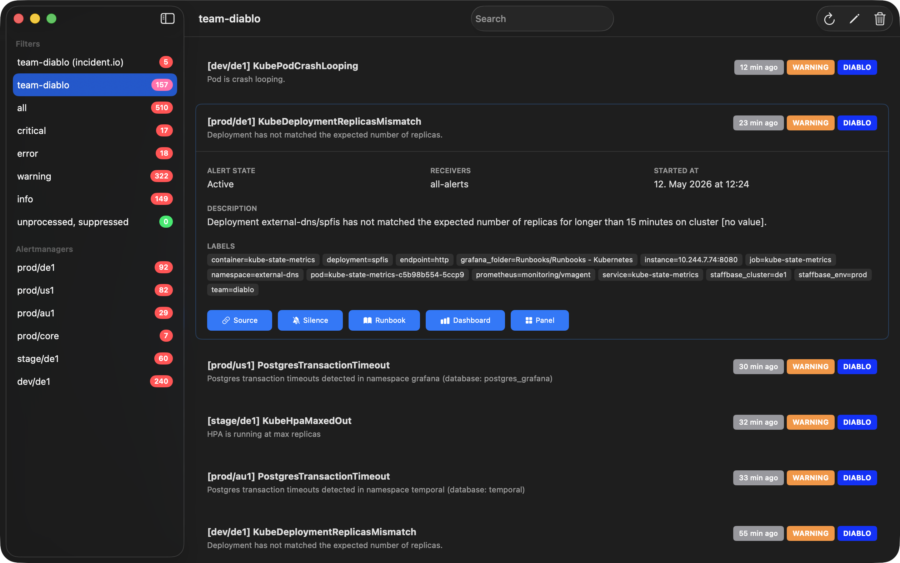

# Alertmanager

**Alertmanager** is a native macOS app for viewing alerts from
[Prometheus Alertmanager](https://prometheus.io/docs/alerting/latest/alertmanager/)
and [Grafana Alerting](https://grafana.com/docs/grafana/latest/alerting/).



## Features

- Connect to multiple
  [Prometheus Alertmanager](https://prometheus.io/docs/alerting/latest/alertmanager/)
  and [Grafana Alerting](https://grafana.com/docs/grafana/latest/alerting/)
  instances, with basic authentication or bearer token authentication (token can
  be read from a file or a shell command)
- Save custom filters scoped by Alertmanager, receiver, labels, and alert state
  (firing, silenced, inhibited)
- Menu bar mode that surfaces a configurable filter at a glance
- Desktop notifications for new alerts matching a filter, with quick actions for
  source, silence, runbook, and Grafana dashboard/panel
- Alert details with status, receivers, timestamps, and labels — plus direct
  links to the source and a one-click silence action
- Quick links to runbooks (`runbook_url` annotation) and Grafana dashboards and
  panels (`__dashboardUid__` / `__panelId__` annotations)
- Copy any alert as Markdown — including the backend URL, resolved credentials,
  labels, and annotations — ready to paste into chats, issues, or runbooks
- Custom label badges: map label keys to colors in the settings to surface
  matching label values next to the alert title
- Configurable refresh interval (1 minute to 1 hour)
- Import and export the full configuration (Alertmanagers, filters, settings) as
  JSON
- Update check on launch that shows an in-app banner when a newer release is
  available on GitHub

## Development

```bash
# Build (Debug, macOS)
xcodebuild build -project Alertmanager.xcodeproj -scheme Alertmanager -configuration Debug

# Build (Release)
xcodebuild archive -project Alertmanager.xcodeproj -scheme Alertmanager -configuration Release -archivePath build/Alertmanager.xcarchive
```

```bash
# Run all tests
xcodebuild test -project Alertmanager.xcodeproj -scheme Alertmanager

# Unit tests only (Swift Testing)
xcodebuild test -project Alertmanager.xcodeproj -scheme Alertmanager -only-testing:AlertmanagerTests

# UI tests only (XCTest)
xcodebuild test -project Alertmanager.xcodeproj -scheme Alertmanager -only-testing:AlertmanagerUITests
```

### SourceKit-LSP / `buildServer.json`

To make the SourceKit-LSP working properly with the Xcode project, a
`buildServer.json` file must be generated at the project root using
[`xcode-build-server`](https://github.com/SolaWing/xcode-build-server)
(installable via Homebrew: `brew install xcode-build-server`).

```bash
rm -rf .bundle
xcodebuild build -project Alertmanager.xcodeproj -scheme Alertmanager -configuration Debug -resultBundlePath .bundle
xcode-build-server config -project Alertmanager.xcodeproj -scheme Alertmanager
```

### App crashes on launch after upgrade (SwiftData schema mismatch)

If the app crashes immediately on launch with a
`Failed to create ModelContainer` error after upgrading, the on-disk SwiftData
store was written by an older version whose schema is incompatible with the
current one. The app does not migrate existing data automatically — delete the
store and relaunch to start from a clean slate.

```bash
rm -rf ~/Library/Application\ Support/de.ricoberger.Alertmanager
```

### Notification opens a new (empty) window

If tapping a notification opens a fresh empty window while the alert is
displayed in the already-running window, Launch Services has registered multiple
`Alertmanager.app` bundles under the same identifier
(`de.ricoberger.Alertmanager`) — typically the `/Applications` install alongside
Xcode debug builds, archive intermediates, and trashed copies. The OS delivers
the tap to the running instance _and_ activates one of the stale bundle paths,
which spawns the extra window.

```bash
# 1. Remove trashed copies — they get re-registered on every login
rm -rf ~/.Trash/Alertmanager*

# 2. Remove Xcode build artifacts that Launch Services still indexes
rm -rf ~/Library/Developer/Xcode/DerivedData/Alertmanager-*
rm -rf build

# 3. Unregister every Alertmanager bundle path LS currently knows
LSREG=/System/Library/Frameworks/CoreServices.framework/Versions/A/Frameworks/LaunchServices.framework/Versions/A/Support/lsregister
"$LSREG" -dump 2>/dev/null | awk '/^path:/ && /Alertmanager(\.app| [0-9]+\.[0-9]+\.[0-9]+\.app)/ {sub(/ \(0x[0-9a-f]+\)$/,""); sub(/^path:[ \t]+/,""); print}' \
  | while IFS= read -r p; do "$LSREG" -u "$p"; done

# 4. Quit the running app and re-register only the canonical copy
osascript -e 'tell application "Alertmanager" to quit' 2>/dev/null
"$LSREG" -f /Applications/Alertmanager.app

# 5. Verify only /Applications/Alertmanager.app remains
"$LSREG" -dump 2>/dev/null | grep -E "^path:" | grep -i "alertmanager"
```

If a single registration is not enough, rebuild the entire LS database:

```bash
"$LSREG" -kill -r -domain local -domain system -domain user
"$LSREG" -f /Applications/Alertmanager.app
```
